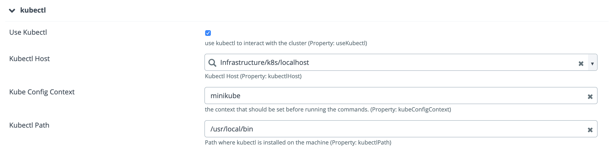

# XL Deploy K8S KUBECTL plugin v1.0.0

[![Build Status][xld-k8s-kubectl-plugin-travis-image]][xld-k8s-kubectl-plugin-travis-url]
[![License: MIT][xld-k8s-kubectl-plugin-license-image]][xld-k8s-kubectl-plugin-license-url]
![Github All Releases][xld-k8s-kubectl-plugin-downloads-image]

[xld-k8s-kubectl-plugin-travis-image]: https://travis-ci.org/xebialabs-community/xld-k8s-kubectl-plugin.svg?branch=master
[xld-k8s-kubectl-plugin-travis-url]: https://travis-ci.org/xebialabs-community/xld-k8s-kubectl-plugin
[xld-k8s-kubectl-plugin-license-image]: https://img.shields.io/badge/License-MIT-yellow.svg
[xld-k8s-kubectl-plugin-license-url]: https://opensource.org/licenses/MIT
[xld-k8s-kubectl-plugin-downloads-image]: https://img.shields.io/github/downloads/xebialabs-community/xld-k8s-kubectl-plugin/total.svg

## Preface

This plugin enhances the official & supported xld-kubernetes-plugin. It
offers to interact with the k8s using the `kubectl` command line instead
of the API on the `k8s.Resources` deployed CI. A dedicated types,
`k8s.kubectl.Resources' exists to).

Sometimes, the direct connection using https is either complicated or
impossible for security reasons (sometime both). By adding a such
feature, it's possible to attach a `kubectlHost` to the `k8s.Master` and
use this host to run the command. This host can be any kind of hosts,
`overthere.LocalHost` or `overthere.SshHost`.

When manipulating resources, the plugin is lazier. It uses:
* `kubect apply` for CREATE & MODIFY operation. (CREATE & REPLACE verbs
  are available as an option as well if needed)
* `kubect delete` for DELETE without failing if it doesn't exit.
* encode sensitive date in kubernetes secrets to use the encrypted entries in the `udm.Dictionary`


## Sample Code 
```
xl --config ./config.yaml apply -f xebialabs.yaml
```

## Installation

* Copy the latest JAR file from the [releases page](https://github.com/xebialabs-community/xld-k8s-kubectl-plugin/releases) into the `XL_DEPLOY_SERVER/plugins` directory
* Add [https://github.com/xebialabs-community/overthere-pylib/releases/tag/v0.0.4](https://github.com/xebialabs-community/overthere-pylib/releases/download/v0.0.4/overtherepy-0.0.4.jar) to your plugin directory 
* Restart the XL Deploy server.

## Features

### Infrastructure



## References

